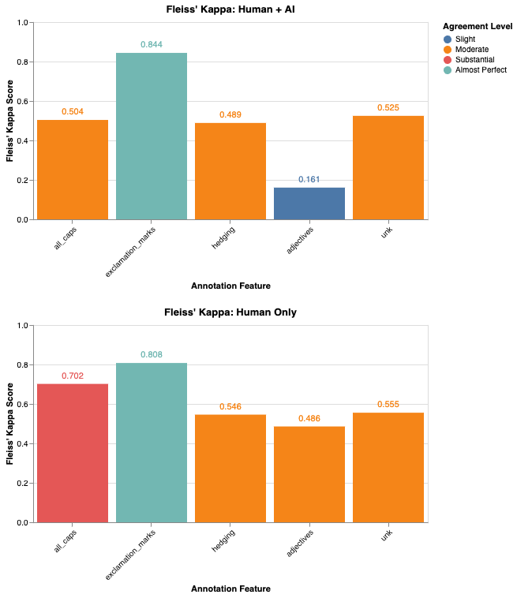
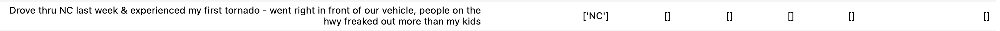
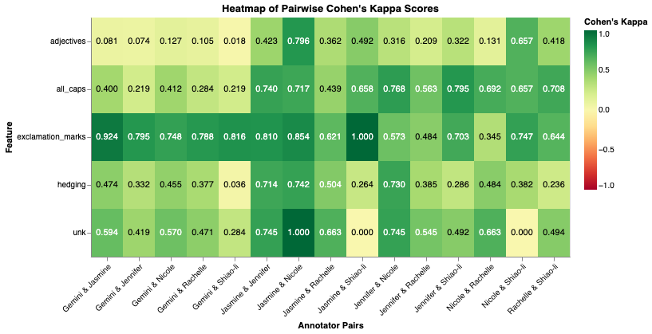

# Interannotator Agreement Study Overview

Our team annotated 1000 items from a misinformation dataset. A core subset of 40 items was annotated by all four human annotators and Google's Gemini LLM to enable direct interannotator agreement analysis. Each of the four primary human annotators annotated a total of 310 items. The 310 items were assigned so that there were multiple pair overlaps, as well as human-AI overlap. Finally, a fifth annotator annotated an additional 100 items,  which included some overlap with every other annotator. 

| Annotator | 5-Way Overlap | Pairwise Overlaps | Solo Assignment (Human + AI) | Total Workload |
| :--- | :--- | :--- | :--- | :--- |
| **Jennifer** | 0–40 | 41–100 | 161–370 | 310 items |
| **Nicole** | 0–40 | 41–60, 101–140 | 371–580 | 310 items |
| **Rachelle** | 0–40 | 61–80, 101–120, 141–160 | 581–790 | 310 items |
| **Shiao-li** | 0–40 | 81–100, 121–160 | 791–1000 | 310 items |
| **AI** | 0–40 | 41–160 | 161–1000 | 1000 items |
| **Jasmine** | 0–40 | 41–52, 53-64, 101-112,  121-132 , 141-152 | - | 100 items |

## Metrics Used:

Having variable numbers of annotators per item allowed us to use multiple metrics in our analysis of inter-annotator agreement. When we had more than two annotators for an item we used **Fleiss' Kappa** (κ) to evaluate agreement. When we had only two annotators for an item, we used **Cohen's Kappa** to evaluate agreement. 

*Kappa interpretation guide: <0.20 (slight), 0.21-0.40 (fair), 0.41-0.60 (moderate), 0.61-0.80 (substantial), >0.81 (almost perfect)* In addition, in order to get more details on which annotators agreed, we also performed an analysis using Cohen's Kappa for every paired overlap, even when more than two annotations existed for that item. Finally, we used Fleiss' Kappa to evaluate agreement of all annotators and then a second time to evaluate agreement of human annotators only.

# Interannotator Agreement Study Results

## Fleiss' Kappa Results

Overall, the inclusion of AI annotations led to a decrease in agreement across the majority of features, with the exception of the "All Caps" annotation. Gemini performed reliably for punctuation. Its inclusion in detecting exclamation marks increased the Fleiss' Kappa from 0.808 to 0.844. 

However, its performance on detecting linguistic nuance drove down the other Fleiss' Kappa scores. The most significant gap between the agreement of the all-human annotation group and the human + AI group occurred for the labeling of adjectives. Human agreement achieved a score of "moderate" (κ = 0.486), while humans + AI score was in the "slight" category (κ = 0.161). The difference in the two Fleiss' Kappa scores suggests that perhaps AI struggled with identifying which word is an adjective vs other parts of speech. Looking at some of the differences in adjective tagging shows Gemini tagging all words that had the suffixes specified, even if the word was not being used as an adjective.

In the "All Caps" annotation task, AI brought the Fleiss' Kappa score down from 0.702 (all humans) to 0.504 (humans + AI). Looking through individual items that Gemini tagged differently, we can see that, despite being told not to tag capitalized abbreviations and acronyms as "All Caps," it often did. One example of this is the annotation of following item:

Gemini capitalized the state abbreviation for North Carolina (NC), while the humans did not. This example is typical of the differences we saw between AI and humans.

Finally, when we consider the inter-annotation agreement of the human annotators only, we see a range from 0.486 to 0.808 in Fleiss' Kappas. Even among humans, labeling the adjectives, given only a list of suffixes, is a difficult task, with a Fleiss' Kappa score of 0.486 (moderate). Not only does the annotator have to find words with the listed suffixes, they also have to determine if the word is an adjective in the context of the sentence. This requires multiple steps: one that is strict matching and one that is detecting nuance. 

Similarly, annotators' agreement also scored in the moderate category for both "unk," which we used to label profanity, as well as "hedging." In the case of profanity, the differences may be due to differences on what words are profane. Is "butt" a profane word? Some thought so, others didn't. Another difference was whether an acronym that included a profane word should be considered profane (WTF, for example). 

Similar to the adjective labeling task, hedging words required two steps from the annotator. The first step was to spot a word that is included in the list of "hedging words" provided to the annotators. After finding the word, the annotator had to determine whether its usage was hedging. In addition, annotators had to decide whether a hedging word in an alternate form should be labeled. For example: think, thinking, thought, thoughtfully, unthoughtfully,etc. Despite these challenges, the human annotators achieved a minimum of "moderate" agreement with all labels.

## Cohen's Kappa

Pairwise Cohen's Kappa scores between human annotators (e.g., Jasmine & Shiao-li) showed multiple instances of "Substantial" and even "Perfect" (1.000) agreement on "Unk" labels, whereas Gemini's agreement with the same humans was consistently lower (ranging from 0.03 to 0.47). This result is consistent with the Fleiss' Kappa results. 

The pairwise Cohen's κ scores will be used downstream to choose the best annotation per item from our overlapping annotations. When there are only two overlapping human annotations, the annotation created by the annotator who has the higher average of all pairwise Cohen's κ scores will be assumed to be the correct annotation. When the overlap is only between a human and AI, the human annotation will be assumed to be correct.

## Conclusion

### Choice of Agreement Measures

We selected **Fleiss' κ** as our primary inter-annotator agreement measure for items with multiple annotators (>2), complemented by **Cohen's κ** for pairwise analysis. This choice is justified by several factors:

1. **Multi-rater capability**: Fleiss' κ accommodates our design with 4-5 annotators per core item, providing a single agreement statistic across all raters
2. **Categorical data appropriateness**: Both measures are designed for nominal categorical annotation tasks like our linguistic feature tagging
3. **Established benchmarks**: Kappa statistics have well-defined interpretation standards in NLP annotation research
4. **Complementary insights**: Cohen's κ pairwise analysis reveals which specific annotator combinations drive overall agreement patterns

### Reliability Assessment

**Our human annotation demonstrates acceptable reliability** for downstream NLP applications. Human-only Fleiss' κ scores achieved "moderate" to "almost perfect" agreement (κ = 0.486-0.808), with four of five features reaching κ > 0.54. This reliability level meets or exceeds benchmarks commonly reported in linguistic annotation studies.

The **"almost perfect" agreement on exclamation marks** (κ = 0.808) validates our annotation protocol's effectiveness for objective linguistic features. Even challenging subjective tasks like hedging detection achieved "moderate" reliability (κ = 0.546), indicating consistent annotator training and clear guidelines.

### Addressing Lower Agreement Scores

**Adjective identification** represented our most challenging annotation task (κ = 0.486), though this score remains within the "moderate" reliability range. This lower agreement stems from the inherent complexity of the task, which required annotators to:

1. Identify words with target suffixes (pattern matching)
2. Determine contextual part-of-speech usage (linguistic analysis)
3. Resolve ambiguous cases where words function as multiple parts of speech

**Quality assurance measures implemented** to maximize reliability included:
- **Comprehensive annotation guidelines** with explicit examples and edge cases
- **Pilot annotation sessions** to refine instructions and identify ambiguities
- **Multiple annotator overlap design** enabling agreement calculation and error detection
- **Regular annotator meetings** to discuss challenging cases and maintain consistency

### Recommendations for Future Improvement

To enhance annotation reliability in future iterations:

1. **Expand training data**: Provide more examples of ambiguous adjective cases during annotator training
2. **Implement adjudication protocols**: Establish systematic procedures for resolving disagreements on challenging items
3. **Refine AI integration**: Given Gemini's systematic errors (especially with abbreviations and contextual usage), develop more targeted prompts or post-processing rules
4. **Consider hierarchical annotation**: Break complex tasks like adjective identification into separate passes (suffix detection, then contextual verification)

### Impact on Research Validity

Our reliability analysis supports the validity of using this annotated dataset for misinformation detection research. The human annotation quality (κ = 0.486-0.808) provides a solid foundation for training and evaluating NLP models, while the systematic analysis of AI annotation differences offers valuable insights into current LLM limitations for linguistic annotation tasks.

**Code availability**: All inter-annotator agreement calculations were performed using custom Python scripts available in our project repository at [src/Interannotator_Analysis.py](../src/Interannotator_Analysis.py) and demonstrated interactively in [src/Interannotator_Analysis.ipynb](../src/Interannotator_Analysis.ipynb).

